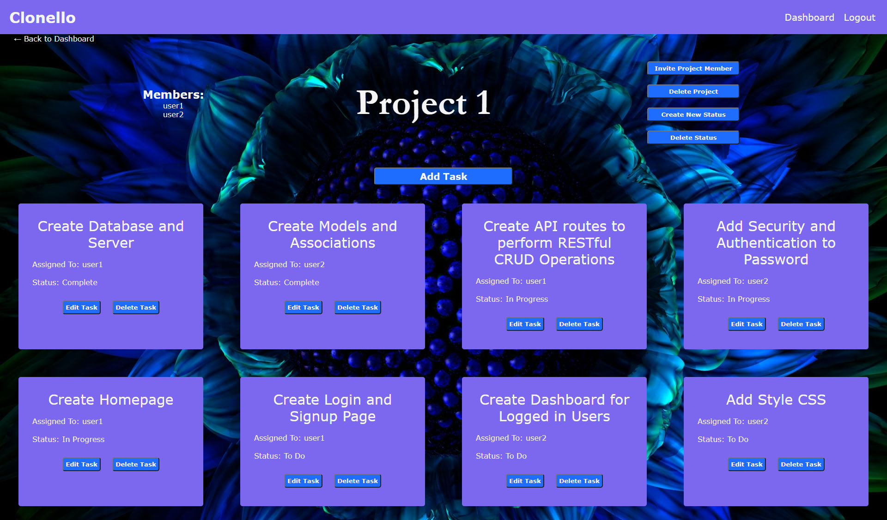

# Clonello

## Table of Contents
* [Deployed](#deployed)
* [Description](#description)
* [Technologies](#technologies)
* [Usage](#usage)
* [Preview](#preview)
* [Credits](#credits)

## Deployed
Click [here](https://powerful-falls-76508.herokuapp.com/) to access the application.

## Description
A Trello inspired application that allows group members to create and assign tasks to help manage the progress of their project.

## Technologies
### Made With
* HTML
* CSS
* JavaScript

### Deployment
* Deployed with Heroku

### Packages
* Handlebars.js
* Sequelize
* Express
* Express-Session
* Connect-Session
* Bcrypt
* Dotenv
* MySQL2
* Pluralize

## Usage
Upon first visiting the site, you will be presented with the homepage, which includes a description of the website and the option to log in or sign up.

Selecting "Sign Up" will take the user to a new page where they can create an account and be immediately logged in.

Upon logging in, the user will be taken to the dashboard. The navigation bar contains links to return to the dashboard or logout.

The dashboard will display all of the user's current projects if there are any. To add a project, fill out the Add Project form and it will be added to the list.

Clicking the title of the project will bring the user to the project's page with a list of all the project's tasks. User can also invite a member to the project, add a new task, create a status to add to the task description, and delete a status, project, or task.

Each task card contains the name, username of the project member assigned to the task, and the status of the project. There are also edit and delete buttons for each task. Selecting "Delete Task" will remove the task. Selecting "Edit Task" will take the user to a new page.

On the edit task page, the user can choose to change any element of the task, and upon saving, user will be taken back to the project page with their updated task on display.

## Preview

## Credits
Made By Sara Adamski, Ronald Main, Angela Man, and Bayleigh Walker